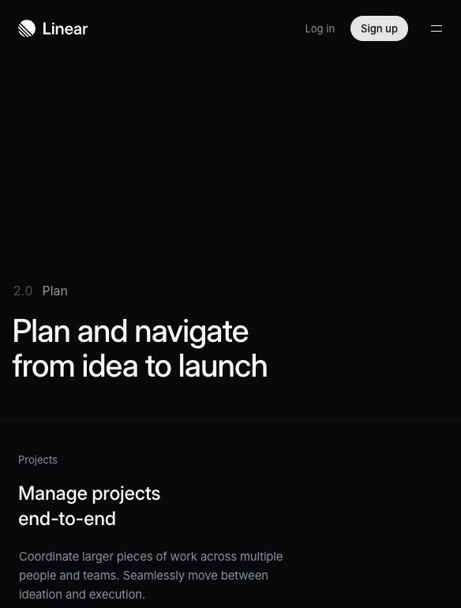

# Linear Audit

Research date: June 7, 2026
Observed URLs:

- https://linear.app/
- https://linear.app/plan

## Screenshot Evidence

Observed at: https://linear.app/

The first viewport communicates one category, one sentence of value, and one product image. The product screenshot is not decorative: it shows the actual density, sidebar, issue hierarchy, status metadata, and activity context.

Observed at: https://linear.app/plan

The Plan page uses a numbered product sequence (`2.0 Plan`) and then repeats a stable pattern of section label, heading, explanation, and product evidence.

## A. Navigation Audit

### Observed

- The public header is intentionally sparse: logo, login, signup, and a compact menu.
- The homepage presents the product model through a numbered sequence: Intake, Plan, Build, Diffs, Monitor.
- Inside the illustrated product UI, global items such as Inbox and My Issues are separated from workspace structures such as Initiatives and Projects.
- A specific issue maintains local context through title, activity, status, priority, labels, cycle, and project.

### Assessment

Linear makes a complex system legible by separating three layers:

1. Global destination.
2. Workspace or collection.
3. Current object and its metadata.

A new visitor understands “product development system” immediately, but detailed feature discovery is deferred until after the main proposition.

## B. Homepage Audit

### Three-second message

“This is a serious, integrated system for product development.”

### Next action

- Sign up.
- Inspect the product image.
- Continue into the numbered product sequence.

### Density

The first viewport is spacious, but not empty. The product screenshot carries high information density below a concise message. This creates a productive contrast: low-density explanation, high-density evidence.

## C. Layout System Audit

### Observed

- Strong common left edge.
- Large headline with short line lengths.
- Muted secondary copy.
- Product screenshots are integrated into the section rather than placed in unrelated cards.
- Sections are organized as sequences rather than isolated promotional tiles.
- Dark surfaces use subtle borders and tonal steps, not many floating panels.

### Why it feels balanced

Linear alternates between explanatory space and concrete product evidence. Empty space always prepares a meaningful object. It does not fill every gap with a card.

## D. Learning Experience Audit

Linear is not an educational product, but it provides useful progression patterns:

- Numbered stages establish order.
- Adjacent stages remain visible as next steps.
- Object state is continuously available.
- The current item does not lose its parent project context.

For Archistory, the useful analogy is not “turn learning into project management.” It is “keep path, stage, and current term visible as distinct levels.”

## E. Knowledge Architecture Audit

Linear connects issues to projects, cycles, labels, priorities, updates, and initiatives. Relationships are explicit metadata, not hidden recommendations.

The product preserves context by showing the current object alongside the fields that explain why it belongs where it does.

## Archistory Comparison

### Can Copy

- One stable outer alignment system.
- Clear separation of global, collection, and object levels.
- Lightweight labels for current state.
- Stage numbering and adjacent next-step links.
- Dense information represented through typography and borders rather than nested cards.

### Should Adapt

- Treat Architecture Student as the canonical entry point, similar to an initiative.
- Treat each learning stage as a stable context, similar to a project.
- Treat glossary terms and code topics as current objects with visible parent context.
- Use a low-density introduction followed by real learning evidence.

### Should Avoid

- SaaS dashboard language.
- Productivity metrics and urgency.
- Dark technical styling as a brand identity.
- Command-oriented interfaces for casual archive visitors.
- Turning every relationship into status metadata.

## Main Lesson

Linear’s strongest contribution is structural discipline. Archistory should borrow its alignment, hierarchy, and context preservation, not its software-management personality.
