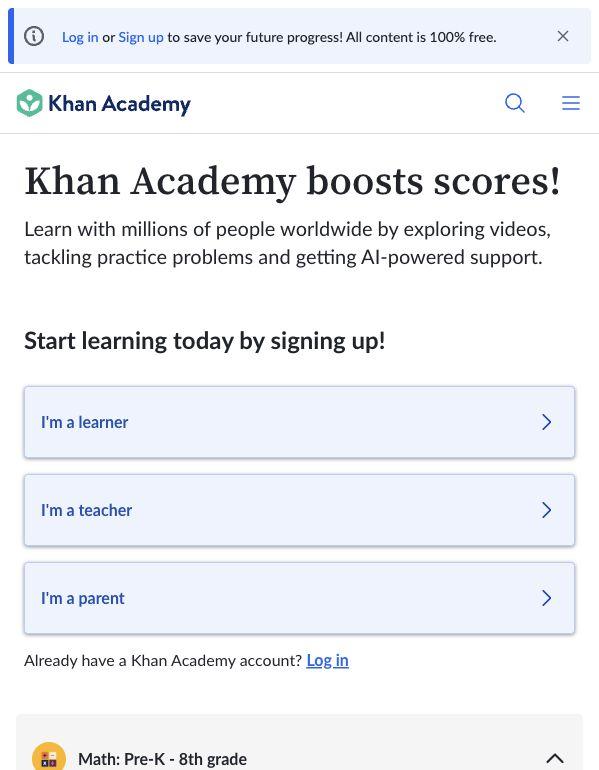
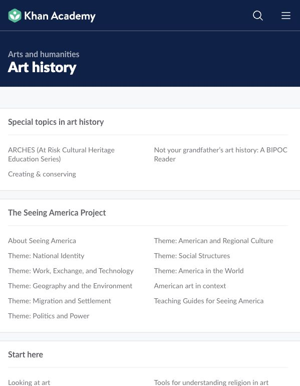

# Khan Academy Audit

Research date: June 7, 2026
Observed URLs:

- https://www.khanacademy.org/
- https://www.khanacademy.org/humanities/art-history

## Screenshot Evidence

Observed at: https://www.khanacademy.org/

The homepage identifies user intent immediately with Learner, Teacher, and Parent entry points, then exposes course categories.

Observed at: https://www.khanacademy.org/humanities/art-history

The course page uses a strong subject header, grouped course units, and a plainly labeled “Start here” section.

## A. Navigation Audit

### Observed

- Header contains brand, search, and menu.
- Homepage onboarding asks users to identify their role.
- Courses are grouped by recognizable subject and level.
- Course pages use breadcrumbs and a persistent subject title.

### Assessment

The user can find the core function quickly because “start learning” is explicit. The navigation does not assume users understand the content taxonomy before beginning.

## B. Homepage Audit

### Three-second message

“This is a free learning platform; choose who you are and begin.”

### Next action

- Select Learner, Teacher, or Parent.
- Open a subject category.
- Search for a course or skill.

### Density

The first action area is simple. The full course catalog is dense but grouped. The hierarchy allows users to stop at the level they understand.

## C. Layout System Audit

### Observed

- Strong color band identifies the current subject.
- Units are separated by dividers and section titles.
- Links are lightweight text rows rather than large cards.
- Two-column lists increase density while preserving scanability.
- “Start here” is ordinary language, not a branded feature name.

### Why it feels balanced

The page does not give every item equal visual decoration. Subject, unit, and lesson are differentiated primarily through typography, grouping, and indentation.

## D. Learning Experience Audit

### Observed

- Beginner entry is explicit.
- Course content is broken into units and lessons.
- Some areas include tests and mastery progression.
- The product repeatedly communicates where to begin and what belongs together.
- Learning state and progress are stronger for signed-in users, but the public structure remains understandable.

### Relevant lesson

Archistory needs a visible default start and persistent path context before it needs scores, accounts, or completion mechanics.

## E. Knowledge Architecture Audit

Khan Academy organizes knowledge through:

- domain
- course
- unit
- lesson or exercise

Art History also supports thematic and chronological groupings. The same content can be approached through “Start here,” period, geography, or theme.

## Archistory Comparison

### Can Copy

- “Start here” language.
- Path > stage > term/topic hierarchy.
- Lightweight lists for stage contents.
- Explicit beginner routes.
- Clear next-item guidance.

### Should Adapt

- Use Architecture Student as the recommended course-like route.
- Allow History Explorer to organize archive entities by period and theme.
- Show progression without requiring accounts.
- Use estimated time and stage scope to reduce uncertainty.

### Should Avoid

- Grade-level identity.
- Scores, streaks, badges, and mastery percentages as the main motivation.
- Test preparation as the product center.
- Mandatory role selection before exploration.
- Treating buildings only as lesson illustrations.

## Main Lesson

Khan Academy proves that a large content library becomes a learning product when it clearly names the starting point, groups material into stages, and continuously answers “what next?”
