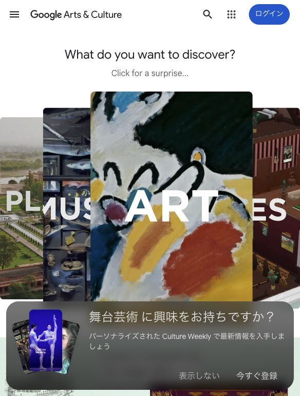
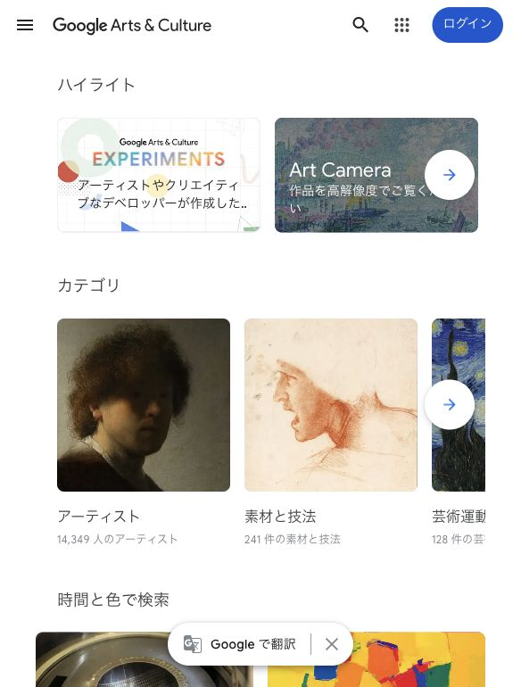

# Google Arts & Culture Audit

Research date: June 7, 2026
Observed URLs:

- https://artsandculture.google.com/
- https://artsandculture.google.com/explore
- https://artsandculture.google.com/time

## Screenshot Evidence

Observed at: https://artsandculture.google.com/

The homepage opens with a discovery question and immediately offers stories, collections, virtual experiences, artists, places, colors, and recommendations.

Observed at: https://artsandculture.google.com/explore

The Explore page exposes multiple archive axes: artists, media, movements, events, people, places, time, color, themes, and collections.

## A. Navigation Audit

### Observed

- Header is minimal: menu, brand, search, app launcher, login.
- Most discovery happens within the page rather than the global header.
- Explore categories are named in familiar cultural language.
- Search remains globally available while curated paths provide alternatives.

### Assessment

The site prioritizes curiosity over exhaustive navigation. A new user understands that the product is for discovery, but may not know which route is educationally optimal.

## B. Homepage Audit

### Three-second message

“Discover culture through visual stories and surprising connections.”

### Next action

- Open the daily adventure.
- choose a story or collection
- explore an artist, place, movement, color, or museum

### Density

The page is content-rich, but strong images and sectional headings prevent it from feeling like a raw database. Each section proposes a discovery question.

## C. Layout System Audit

### Observed

- Image-led cards vary in size according to emphasis.
- Section headings use plain, inviting language.
- Horizontal collections allow many options without showing all detail at once.
- Metadata remains short.
- Category cards pair an image, label, and item count.

### Why it feels balanced

Visual assets carry meaning. Text does not repeat what the image already communicates. Sections are separated by clear questions and themes.

## D. Learning Experience Audit

The product does not provide a consistent curriculum. It supports learning through:

- editorial stories
- thematic projects
- object relationships
- chronological browsing
- visual comparison

The time page maps works to historical intervals, but it is primarily an exploration tool rather than a guided learning path.

## E. Knowledge Architecture Audit

The archive connects:

- assets
- artists
- movements
- materials
- places
- historical figures
- events
- collections
- stories
- time and color

Entity pages and recommendations explain why items are related, such as same period, movement, collection, material, or visual similarity.

## Archistory Comparison

### Can Copy

- Multiple understandable archive axes.
- Image-led discovery.
- Human questions as section headings.
- Visible relationship reasons.
- Time as an interactive discovery axis.

### Should Adapt

- Use buildings as visual evidence inside learning paths.
- Let Timeline lead to movements, architects, buildings, and a history path.
- Curate thematic collections from existing entities.
- Explain why a recommended building or term is related.

### Should Avoid

- Endless discovery without a stable learning destination.
- Entertainment experiments as the main product.
- Image-heavy layouts that weaken factual comparison.
- Recommendations with no path back to the learner’s current stage.

## Main Lesson

Google Arts & Culture shows how an archive can feel alive through questions, images, and multiple discovery axes. Archistory must add stronger learning continuity than Google’s cultural browsing model.
