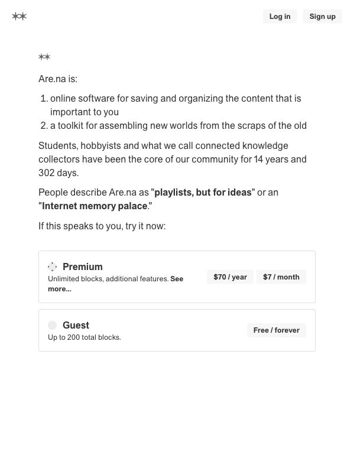
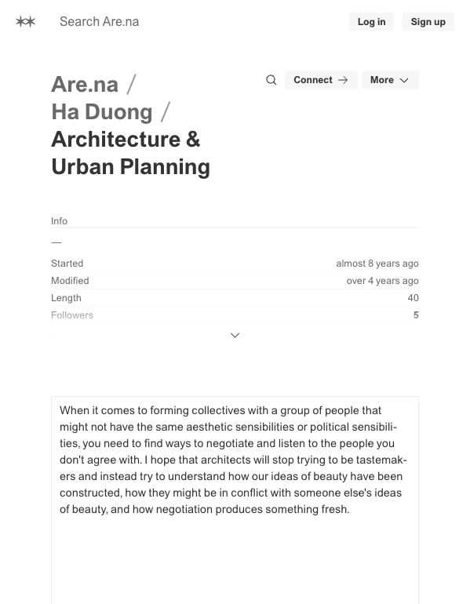

# Are.na Audit

Research date: June 7, 2026
Observed URLs:

- https://www.are.na/
- https://www.are.na/ha-duong/architecture-urban-planning
- https://www.are.na/about

## Screenshot Evidence

Observed at: https://www.are.na/

The homepage explains the product through a short manifesto: saving, organizing, connecting, and building contexts over time.

Observed at: https://www.are.na/ha-duong/architecture-urban-planning

The channel page exposes creator, collection title, metadata, connections to other channels, view modes, and heterogeneous content blocks.

## A. Navigation Audit

### Observed

- Public header is very small: brand, search, login, signup.
- The channel breadcrumb is represented by linked owner and channel names.
- Channel-level actions include search, connect, and view options.
- Related placement is explicit through “This channel appears in.”

### Assessment

Are.na makes the current collection the navigation context. It is understandable after users know what a channel is, but first-time orientation depends heavily on explanatory copy.

## B. Homepage Audit

### Three-second message

“This is a tool for collecting and connecting ideas.”

### Next action

- Try Are.na.
- Learn about features.
- Inspect examples and community language.

### Density

The homepage uses long-form manifesto copy rather than conventional feature marketing. It is calm but demands reading.

## C. Layout System Audit

### Observed

- Minimal chrome.
- Large typography for collection identity.
- Metadata appears as a compact definition list.
- Content blocks preserve their original type: text, link, image, file, or embed.
- Thin borders and generous margins provide structure without heavy cards.

### Why it feels balanced

Are.na accepts heterogeneous content but gives every block the same collection context and simple geometric frame.

## D. Learning Experience Audit

Are.na does not prescribe lessons or progress. It supports:

- self-directed research
- collecting references
- connecting one block to multiple channels
- collaborative context building
- revisiting material over time

It is strong for exploration and weak for beginner sequence.

## E. Knowledge Architecture Audit

The same block can belong to multiple channels. A channel can appear inside other channels. This creates a network without requiring a separate graph visualization.

Context is preserved through:

- creator
- channel
- block source
- connection destinations
- related collections

## Archistory Comparison

### Can Copy

- One entity may belong to multiple meaningful learning contexts.
- Explicit relationship reasons.
- Lightweight collection metadata.
- Heterogeneous content within a stable frame.
- Related collections as navigation.

### Should Adapt

- Let a building appear in multiple stages or historical themes.
- Treat learning collections as curated contexts, not duplicated content.
- Use connections to reveal alternative routes after the primary path.
- Preserve source and entity identity when content appears in a path.

### Should Avoid

- Requiring users to invent their own structure.
- Ambiguous channel terminology.
- Minimal onboarding for beginners.
- An entirely non-linear learning model.
- Community creation features before the core authored product is coherent.

## Main Lesson

Are.na’s strongest idea is that knowledge can belong to several contexts without losing identity. Archistory should adopt this network behavior behind a clearer guided entry.
