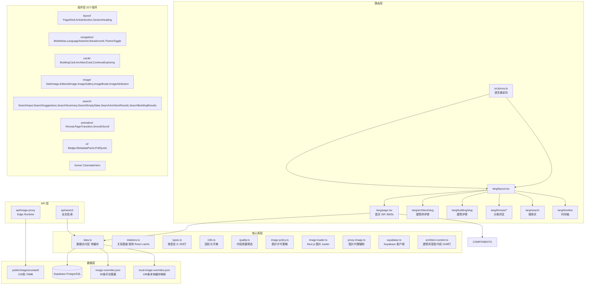

# Architect History Next — 项目全面分析报告

> 分析时间：2026-05-26 | 分析模式：Architect | 模型：deepseek-v4-pro

---

## 1. 项目概览

### 1.1 定位

**世界建筑史档案** — 一个三语（zh/en/ja）建筑知识平台，覆盖建筑历史、风格流派、建筑师、建筑作品、时间轴与深度分析。

目标用户：建筑学生、从业者、研究者及建筑史爱好者。

### 1.2 技术栈

| 层 | 技术 | 版本 |
|----|------|------|
| 框架 | Next.js (App Router) | 16.2.6 |
| 语言 | TypeScript | 5.x (strict) |
| 样式 | Tailwind CSS | v4 |
| 排版 | @tailwindcss/typography | 0.5 |
| 动画 | framer-motion | 12.40 |
| 平滑滚动 | lenis | 1.3 |
| 数据库 | Supabase (PostgreSQL) | - |
| 简繁转换 | opencc-js | 1.3 |
| 部署 | Vercel | Production |

---

## 2. 架构总览



---

## 3. 路由结构

项目使用 Next.js App Router 的 `[lang]` 动态段实现三语路由，通过 [`src/proxy.ts`](src/proxy.ts) 进行语言重定向：

| 路由 | 页面 | 渲染策略 | 说明 |
|------|------|----------|------|
| `/` | 重定向 | 302 | Accept-Language 协商 → `/zh`/`/en`/`/ja` |
| `/[lang]` | 首页 | ISR 3600s | 精选建筑 hero + 时代/风格/建筑师入口 |
| `/[lang]/architect/[slug]` | 建筑师详情 | ISR 86400s | 生平、教育、核心思想、代表作、影响关系图 |
| `/[lang]/building/[slug]` | 建筑详情 | ISR 86400s | 图片画廊、深度分析三模块、技术参数面板 |
| `/[lang]/browse` | 浏览索引 | SSG | 按建筑师/建筑/时代/风格/类型/国家导航 |
| `/[lang]/browse/era/[slug]` | 时代详情 | SSG | 关联风格、建筑师、建筑 |
| `/[lang]/browse/style/[slug]` | 风格详情 | SSG | 父子风格关系、代表人物与建筑 |
| `/[lang]/browse/type/[slug]` | 类型详情 | SSG | 按建筑类型筛选 |
| `/[lang]/browse/country` | 国家索引 | SSG | 按国家/地区浏览 |
| `/[lang]/browse/country/[slug]` | 国家详情 | SSG | 某国家的建筑列表 |
| `/[lang]/search` | 搜索页 | 客户端 | 全站搜索（中文、英文） |
| `/[lang]/timeline` | 时间轴 | ISR 3600s | 按年代分组展示 |
| `/api/image-proxy` | 图片代理 | Edge | 代理外部图片，限白名单域名 |
| `/api/search` | 搜索 API | 动态 | 建筑/建筑师/城市/国家/年份/类型/风格/时代全文检索 |

---

## 4. 数据模型

### 4.1 核心实体关系

```mermaid
erDiagram
    Architect {
        uuid id PK
        string slug
        string name_zh
        string name_en
        string name_ja
        int birth_year
        int death_year
        string-array nationalities
        string era_slug
        string-array style_slugs
        string-array influences
        string-array influenced
        string-array core_ideas
        string bio_zh
        string bio_en
        string bio_ja
    }
    Building {
        uuid id PK
        string slug
        string name_zh
        string name_en
        string name_ja
        string architect_slug
        int year_start
        int year_end
        string city
        string country
        string type_slug
        string-array style_slugs
        string era_slug
        json spatial_feat
        json light_feat
        json circulation
    }
    BuildingImage {
        uuid id PK
        string building_id FK
        string url_original
        string photographer
        string license
        string source_url
        string img_type
        bool is_primary
    }
    Style {
        uuid id PK
        string slug
        string parent_slug
        string era_slug
        string name_zh
        string name_en
        string name_ja
    }
    Era {
        uuid id PK
        string slug
        int year_start
        int year_end
        string name_zh
        string name_en
        string name_ja
    }

    Architect ||--o{ Building : "architect_slug"
    Style ||--o{ Architect : "style_slugs"
    Style ||--o{ Building : "style_slugs"
    Era ||--o{ Architect : "era_slug"
    Era ||--o{ Building : "era_slug"
    Era ||--o{ Style : "era_slug"
    Building ||--o{ BuildingImage : "building_id"
    Style ||--o{ Style : "parent_slug"
```

### 4.2 图片治理层级

```
本地缓存 (local-image-overrides.json, 198条)
  ↓ 优先
手动策展远程URL (image-overrides.json, 39条)
  ↓ 次优先
Supabase images 表 (原始记录)
  ↓ 回退
降级占位符
```

### 4.3 Architect Content Overlay

第一阶段精品内容不修改 Supabase schema，通过 [`src/lib/architect-content.ts`](src/lib/architect-content.ts) (1548行) 按 slug 提供长文 overlay。已覆盖 15 位建筑师（alvar-aalto, le-corbusier, mies-van-der-rohe, frank-lloyd-wright, louis-kahn, tadao-ando, zaha-hadid, im-pei, renzo-piano, frank-gehry, lina-bo-bardi, norman-foster, shigeru-ban, carlo-scarpa, kengo-kuma, niemeyer）。

### 4.4 Junction Tables (v2 迁移已执行)

- `architect_styles`, `building_styles`, `architect_eras`, `building_eras`, `style_eras`
- `architect_influences`

### 4.5 Curated Images (v3 迁移 SQL 已写，未执行)

表 `curated_images` 的迁移 SQL 已写好但未在 Supabase 创建。

---

## 5. 核心库分析

| 文件 | 行数 | 职责 | 状态 |
|------|------|------|------|
| [`types.ts`](src/lib/types.ts) | 252 | 15+ 接口定义、displayName/displayText 辅助函数 | ✅ Building.location 为 unknown |
| [`data.ts`](src/lib/data.ts) | 170 | 数据访问层，带 5 分钟 TTL 内存缓存 | ⚠️ 类型转换多、与 relations.ts 有重复查询 |
| [`relations.ts`](src/lib/relations.ts) | 133 | 知识图谱关系查询，使用 React cache() | ⚠️ 全表拉取后 JS 过滤，数据增长后需优化 |
| [`i18n.ts`](src/lib/i18n.ts) | 136 | 集中式三语字典，80+ 翻译键 | ✅ 设计清晰 |
| [`quality.ts`](src/lib/quality.ts) | 90 | 内容质量筛选 (isWikidataId, hasProperName, isMinimallyComplete) | ⚠️ hasProperName ≈ hasValidName 重复 |
| [`image-policy.ts`](src/lib/image-policy.ts) | 49 | 图片许可策略 (CC0, CC BY, CC BY-SA, Public domain) | ✅ 已修复 CC BY-NC 误判 |
| [`image-loader.ts`](src/lib/image-loader.ts) | 35 | Next.js 自定义图片 loader | ⚠️ 域名列表与 proxy-image.ts 重复 |
| [`proxy-image.ts`](src/lib/proxy-image.ts) | 22 | 外部图片代理 URL 构建 | ⚠️ 同上 |
| [`supabase.ts`](src/lib/supabase.ts) | 10 | Supabase 匿名客户端 | ⚠️ 环境变量使用非空断言 |
| [`architect-content.ts`](src/lib/architect-content.ts) | 1548 | 15 位建筑师精品长文内容 | ✅ 结构清晰 |

---

## 6. 组件架构

共 32 个组件，目前平铺在 `src/components/` 目录中。搜索组件已先行拆入 `components/search/` 子目录。

### 按功能分类

| 类别 | 组件 | 数量 |
|------|------|------|
| 图片系统 | SafeImage, EditorialImage, ImageGallery, ImageBreak, ImageAttribution | 5 |
| 布局 | PageShell, PageTransition, SectionHeading, ArticleSection, Reveal | 5 |
| 内容卡片 | BuildingCard, ArchitectCard, BrowseListing, ContinueExploring | 4 |
| 导航 | MobileNav, LanguageSwitcher, Breadcrumb, ThemeToggle, SmoothScroll | 5 |
| 搜索 (已拆分子目录) | SearchResults (+ search/ 下 6 个子组件) | 7 |
| 特效 | CinematicHero, PullQuote | 2 |
| 通用 UI | Badge, MetadataPanel, ChineseScriptProvider, ChineseScriptToggle | 4 |

### 已知问题
- **ImageGallery.tsx**: 250 行，混合缩略图、灯箱、键盘/触摸导航
- **ContinueExploring.tsx**: 死字段 `ExploreGroup.items[].image` 定义但未使用
- **组件目录无分类**: 除 search/ 外，24 个文件平铺在顶层

---

## 7. 设计系统

来源：[`docs/UI_RULES.md`](docs/UI_RULES.md) | 实现：[`src/app/globals.css`](src/app/globals.css)

### 设计关键词
**建筑杂志感、高信息密度、强 typography、清晰 grid、专业感**

### 色彩

| 色系 | 色值 | 用途 |
|------|------|------|
| paper-50~300 | #fefdfb → #ebe7e0 | 页面背景、卡片背景、边框 |
| warm-50~950 | 暖灰白 → 深暖黑 | 亮模式文字色阶 |
| charcoal-50~950 | 冷灰白 → 深冷黑 | 暗模式色阶 |
| clay | #b8673c | 主强调（链接 hover、活跃状态） |
| terracotta | #c17d5a | 备选强调 |
| ochre | #b8964a | 备选强调 |

### 禁止事项
- ❌ 太空科技风 / 苹果式超大留白 / 玻璃拟态 / 霓虹色
- ❌ 重复大图 / 低信息密度 / 浮夸动画
- ❌ 浅灰承载关键信息文字

---

## 8. 当前项目状态

来源：[`docs/STATUS.md`](docs/STATUS.md)

### 进度
- **Phase 0-3**: ✅ 已完成（初始化、数据模型、路由骨架、国际化、设计系统）
- **Phase 4**: 🔄 75% — 图片治理、内容补全与检索体验
- **Phase 5**: ⏳ 未开始 — 深度内容与优化

### 数据统计
- 建筑：780+ (Supabase)
- 建筑师：400+ (Supabase)
- 精选内容：15 位建筑师精品长文
- 本地缓存图片：218 张 (76MB)，覆盖 198 个建筑
- 图片注册表：632 建筑，4794 张图片

### 未完成模块
| 模块 | 状态 |
|------|------|
| 地图功能 `/[lang]/map` | ⏳ 长期规划 |
| curated_images 表 | ❌ v3 迁移已写但未执行 |
| 建筑师 biography 深度内容 | ⚠️ 部分条目 < 20 字 |
| 日文内容 | ⚠️ name_ja / 日文分析字段大量为空 |
| 图片注册表 → Supabase 迁移 | ⏳ 未开始 |
| 对象存储迁移 (R2/Supabase Storage) | ⏳ 未开始 |

---

## 9. 技术债摘要

来源：[`docs/TECH_DEBT.md`](docs/TECH_DEBT.md)

### 🔴 高优先级
1. **旧数据 type_slug 使用显示名**：需统一迁移为 slug
2. **Proxy 语言匹配策略简单**：不处理 cookie、区域域名

### 🟡 中优先级
3. `image-loader.ts` 与 `proxy-image.ts` 域名列表重复
4. `data.ts` 与 `relations.ts` 关系查询逻辑重复
5. `getBuildingsWithCovers()` 在首页被重复调用
6. 组件目录无分类（24 个文件平铺）
7. ImageGallery 体积过大（250 行）
8. SearchResults 状态/请求逻辑仍集中，可抽 hook

### 🟢 低优先级
9. `Building.location` 类型为 `unknown`
10. `quality.ts` 中 hasProperName 与 hasValidName 重复
11-16. 其他轻微问题

---

## 10. 图片治理流水线

```
scripts/audit-images.mjs → scripts/build-image-registry.mjs → scripts/cache-curated-images.mjs
       (审计)                      (注册表)                        (本地缓存)
```

图片优先级：
1. `local-image-overrides.json` (本地缓存，最快)
2. `image-overrides.json` (手动策展远程 URL)
3. Supabase `images` 表 (原始记录)
4. 无可信图片降级

---

## 11. 关键设计决策

1. **不修改 Supabase schema 实现精品内容**：使用 `architect-content.ts` overlay 模式，降低数据库迁移风险
2. **全表拉取 + JS 过滤**：当前数据量级别可行，数据增长后需迁移到 Supabase `.in()` 查询
3. **图片代理 Edge Runtime**：解决中国大陆访问 Wikimedia/Unsplash 的问题
4. **ISR + 请求级缓存**：首页 3600s ISR，详情页 86400s，数据层 5 分钟 TTL
5. **三语策略**：`zh/en/ja`，中文自动简繁转换（opencc-js），繁体第一版不建独立路由
6. **设计克制**：明确禁止 8 类设计风格，保持建筑杂志专业感
